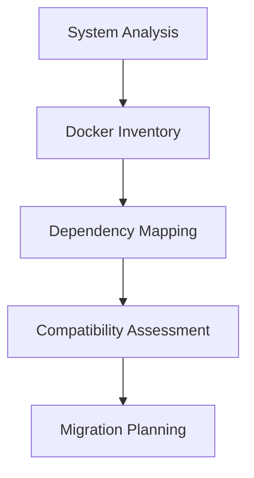

# Discovery Process Guide

Comprehensive guide to analyzing your Docker environment for Podman migration on M1 Macs.

> **Navigation**: [← Quick Start](quick-start.md) | [Migration Planning →](migration-planning.md) | [Best Practices →](best-practices.md)

**Related Documentation:**
- [Quick Start Guide](quick-start.md) - Get started with discovery
- [Migration Planning](migration-planning.md) - Plan your migration strategy
- [Script Reference](../api/script-reference.md) - Detailed command documentation
- [Output Formats](../api/output-formats.md) - Understanding analysis results
- [Troubleshooting](../troubleshooting/common-issues.md) - Discovery issues and solutions

## Table of Contents

1. [Discovery Overview](#discovery-overview)
2. [System Resources Analysis](#system-resources-analysis)
3. [Docker Inventory Analysis](#docker-inventory-analysis)
4. [Dependency Mapping](#dependency-mapping)
5. [Compatibility Assessment](#compatibility-assessment)
6. [Report Analysis](#report-analysis)
7. [Advanced Discovery Techniques](#advanced-discovery-techniques)
8. [Custom Analysis Scripts](#custom-analysis-scripts)

## Discovery Overview

The PodShift discovery process consists of four main phases that analyze different aspects of your Docker environment:



### Discovery Scripts Overview

| Script | Purpose | Duration | Output |
|--------|---------|----------|--------|
| [`system_resources.sh`](../../scripts/discovery/system_resources.sh) | M1 Mac system analysis | ~30 seconds | System capability report |
| [`docker_inventory.py`](../../scripts/discovery/docker_inventory.py) | Complete Docker resource inventory | 1-5 minutes | Resource catalog with M1 compatibility |
| [`dependency_mapper.py`](../../scripts/discovery/dependency_mapper.py) | Container relationship analysis | 2-10 minutes | Dependency graph and migration sequence |
| [`discover_containers.sh`](../../scripts/discovery/discover_containers.sh) | Orchestrates all discovery | 5-15 minutes | Comprehensive reports |

## System Resources Analysis

### Running System Analysis

```bash
# Basic system check
bash scripts/discovery/system_resources.sh

# Verbose analysis with custom output
bash scripts/discovery/system_resources.sh --verbose --output-dir ./reports

# JSON-only output (for automation)
bash scripts/discovery/system_resources.sh --json-only
```

### Understanding System Analysis Output

#### Architecture Detection
```json
{
  "architecture": {
    "architecture": "arm64",
    "is_apple_silicon": true,
    "cpu_model": "Apple M1",
    "podman_native_support": true
  }
}
```

**Key indicators:**
- `is_apple_silicon: true` - Optimal for Podman
- `cpu_model` - Specific Apple Silicon generation
- `podman_native_support` - Native ARM64 performance available

#### Resource Allocation
```json
{
  "cpu": {
    "total_cores": 8,
    "performance_cores": 4,
    "efficiency_cores": 4,
    "recommended_cpu_limit": 6
  },
  "memory": {
    "total_memory_gb": 16,
    "recommended_memory_limit_gb": 12,
    "memory_utilization_percent": 75
  }
}
```

**75% Rule Explanation:**
- Reserve 25% of resources for macOS
- Allocate 75% for container workloads
- Prevents system slowdown and swap usage

#### Compatibility Checks
```json
{
  "recommendations": {
    "critical_issues": [],
    "warnings": [
      "Stop running virtualization software before Podman installation"
    ],
    "recommendations": [
      "Install Rosetta 2 for x86_64 container compatibility"
    ],
    "overall_readiness": "ready",
    "readiness_score": 95
  }
}
```

**Readiness Scoring:**
- **90-100**: Ready for immediate migration
- **75-89**: Minor issues to address first
- **60-74**: Preparation required
- **Below 60**: Significant work needed

### System Analysis Troubleshooting

#### Low Readiness Score
```bash
# Identify specific issues
jq '.recommendations.critical_issues[]' system_resources_*.json

# Common fixes:
# 1. Upgrade macOS if version too old
sudo softwareupdate -ia

# 2. Free up disk space if insufficient
# Use Storage Management in System Preferences

# 3. Install Rosetta 2 if missing
softwareupdate --install-rosetta
```

#### Memory Warnings
```bash
# Check current memory usage
memory_pressure

# Free up memory before migration
sudo purge

# Close unnecessary applications
# Consider upgrading RAM for large environments
```

## Docker Inventory Analysis

### Running Docker Inventory

```bash
# Complete inventory analysis
python scripts/discovery/docker_inventory.py --verbose

# Specific resource types
python scripts/discovery/docker_inventory.py --containers-only
python scripts/discovery/docker_inventory.py --images-only
python scripts/discovery/docker_inventory.py --volumes-only
python scripts/discovery/docker_inventory.py --networks-only
```

### Understanding Docker Inventory Output

#### Container Analysis
```json
{
  "containers": [
    {
      "id": "abc123",
      "name": "web-server",
      "image": "nginx:latest",
      "status": "running",
      "platform": "linux/arm64",
      "m1_compatibility": {
        "compatibility_score": 95,
        "issues": [],
        "recommended_actions": []
      },
      "host_config": {
        "privileged": false,
        "port_bindings": {"80/tcp": [{"HostPort": "8080"}]},
        "memory": 536870912
      }
    }
  ]
}
```

**Key analysis points:**
- `platform`: Architecture compatibility
- `compatibility_score`: M1 readiness (0-100)
- `privileged`: Security considerations
- `port_bindings`: Network configuration
- `memory`: Resource usage

#### Image Architecture Analysis
```json
{
  "images": [
    {
      "id": "sha256:xyz789",
      "tags": ["nginx:latest"],
      "architecture": "arm64",
      "size": 142275443,
      "m1_compatibility": {
        "architecture": "arm64",
        "native_arm64": true,
        "emulation_required": false,
        "multi_arch": true
      }
    }
  ]
}
```

**Architecture priorities:**
1. **ARM64 native** - Best performance
2. **Multi-architecture** - Good compatibility
3. **AMD64 only** - Requires emulation (slower)

#### Volume and Network Analysis
```json
{
  "volumes": [
    {
      "name": "app-data",
      "driver": "local",
      "mountpoint": "/var/lib/docker/volumes/app-data/_data",
      "in_use": true,
      "used_by": [
        {
          "container_name": "database",
          "mount_destination": "/var/lib/postgresql/data"
        }
      ]
    }
  ],
  "networks": [
    {
      "name": "app-network",
      "driver": "bridge",
      "is_custom": true,
      "connected_containers": [
        {"name": "web-server"},
        {"name": "database"}
      ]
    }
  ]
}
```

### M1 Compatibility Analysis

#### Overall Compatibility Report
```json
{
  "m1_compatibility": {
    "overall_compatibility_score": 85.5,
    "arm64_images": 12,
    "amd64_images": 8,
    "multi_arch_images": 4,
    "potential_issues": [
      {
        "category": "Architecture Compatibility",
        "issue": "Found 8 AMD64 images that will require emulation",
        "severity": "medium",
        "affected_images": ["postgres:12", "redis:alpine"],
        "recommendation": "Consider finding ARM64 alternatives"
      }
    ]
  }
}
```

#### Issue Categories and Resolutions

**Architecture Issues**
```bash
# Problem: AMD64-only images
# Detection: "emulation_required": true
# Solutions:
# 1. Find ARM64 alternative: nginx:latest (multi-arch)
# 2. Build custom ARM64 image
# 3. Accept emulation performance penalty
```

**Security Issues**
```bash
# Problem: Privileged containers
# Detection: "privileged": true
# Solutions:
# 1. Use specific capabilities: --cap-add=NET_ADMIN
# 2. Review actual requirements
# 3. Redesign for rootless operation
```

**Socket Mounting**
```bash
# Problem: Docker socket mounts
# Detection: "/var/run/docker.sock" in mounts
# Solution: Update to Podman socket path
# Docker: /var/run/docker.sock
# Podman: /run/user/$(id -u)/podman/podman.sock
```

## Dependency Mapping

### Running Dependency Analysis

```bash
# Complete dependency analysis
python scripts/discovery/dependency_mapper.py --verbose

# Include specific Docker Compose files
python scripts/discovery/dependency_mapper.py --compose-files docker-compose.yml docker-compose.prod.yml

# Skip Docker Compose analysis
python scripts/discovery/dependency_mapper.py --containers-only
```

### Understanding Dependency Output

#### Dependency Graph Structure
```json
{
  "dependency_graph": {
    "nodes": ["web-server", "database", "redis", "api-server"],
    "edges": [
      {"from": "web-server", "to": "api-server", "type": "depends_on"},
      {"from": "api-server", "to": "database", "type": "depends_on"},
      {"from": "api-server", "to": "redis", "type": "depends_on"}
    ],
    "cycles": [],
    "startup_order": ["database", "redis", "api-server", "web-server"]
  }
}
```

#### Migration Sequence Planning
```json
{
  "migration_sequence": {
    "phases": [
      {
        "name": "Phase 1",
        "containers": ["database", "redis"],
        "parallel": true,
        "description": "Independent foundation services"
      },
      {
        "name": "Phase 2",
        "containers": ["api-server"],
        "parallel": false,
        "description": "Services depending on Phase 1"
      },
      {
        "name": "Phase 3",
        "containers": ["web-server"],
        "parallel": false,
        "description": "Frontend services"
      }
    ],
    "estimated_duration": {
      "estimated_parallel_hours": 2.5,
      "time_savings_percent": 35
    }
  }
}
```

#### Dependency Types Detected

**Network Dependencies**
```json
{
  "network_dependencies": [
    {
      "container": "api-server",
      "network": "app-network",
      "type": "network_shared"
    }
  ]
}
```

**Volume Dependencies**
```json
{
  "volume_dependencies": [
    {
      "container": "backup-service",
      "volume": "app-data",
      "type": "volume_shared",
      "source_path": "/backup",
      "target_path": "/var/lib/postgresql/data"
    }
  ]
}
```

**Environment Variable Dependencies**
```json
{
  "environment_dependencies": [
    {
      "container": "database",
      "environment_variable": "DB_HOST",
      "value": "postgres-server",
      "type": "env_reference"
    }
  ]
}
```

### Handling Circular Dependencies

#### Detecting Cycles
```json
{
  "dependency_graph": {
    "cycles": [
      ["service-a", "service-b", "service-c", "service-a"]
    ]
  }
}
```

#### Resolution Strategies
```bash
# 1. Break the cycle by removing non-essential dependencies
# 2. Use health checks and retry logic
# 3. Implement gradual startup with backoff
# 4. Manual intervention in migration sequence
```

## Compatibility Assessment

### ARM64 Image Assessment

#### Finding ARM64 Alternatives
```bash
# Check image manifest for multi-arch support
docker buildx imagetools inspect nginx:latest

# Search for ARM64-specific tags
docker search --filter is-official=true nginx | grep arm64

# Common ARM64 image patterns:
# - Multi-arch official images (recommended)  
# - arm64v8/ prefixed images
# - Platform-specific tags (linux/arm64)
```

#### Popular ARM64-Ready Images
```yaml
# Web servers
nginx:latest                    # Multi-arch official
httpd:latest                   # Multi-arch official  
caddy:latest                   # Multi-arch official

# Databases
postgres:latest                # Multi-arch official
mysql:latest                   # Multi-arch official
redis:latest                   # Multi-arch official
mongodb:latest                 # Multi-arch official

# Application runtimes
node:18-alpine                 # Multi-arch official
python:3.11-slim              # Multi-arch official
openjdk:17-jre-slim           # Multi-arch official
golang:1.19-alpine            # Multi-arch official

# Base images
alpine:latest                  # Multi-arch official
ubuntu:22.04                   # Multi-arch official
debian:bullseye-slim          # Multi-arch official
```

### Performance Impact Assessment

#### Emulation Performance Penalties
```yaml
Native ARM64:           100% performance baseline
Multi-arch (ARM64):     95-100% performance  
AMD64 under emulation:  60-80% performance
Mixed architecture:     Varies by workload
```

#### Workload-Specific Considerations
```yaml
CPU-intensive tasks:    Higher emulation penalty
I/O-intensive tasks:    Lower emulation penalty  
Network services:       Minimal emulation impact
Database operations:    Moderate emulation penalty
```

## Report Analysis

### Comprehensive Analysis Workflow

```bash
# 1. Generate all reports
make discovery

# 2. Extract key metrics
echo "=== SYSTEM READINESS ==="
jq -r '.podman_readiness | "Score: \(.overall_score)/100, Status: \(.status)"' system_resources_*.json

echo "=== COMPATIBILITY SUMMARY ==="
jq -r '.m1_compatibility | "ARM64: \(.arm64_images), AMD64: \(.amd64_images), Score: \(.overall_compatibility_score)"' docker_inventory_*.json

echo "=== MIGRATION COMPLEXITY ==="
jq -r '.migration_sequence | "Phases: \(.total_phases), Duration: \(.estimated_duration.estimated_parallel_hours)h"' container_dependencies_*.json

# 3. Identify critical issues
echo "=== CRITICAL ISSUES ==="
jq -r '.m1_compatibility.potential_issues[] | select(.severity == "high") | .issue' docker_inventory_*.json
```

### Decision Matrix

Create a migration decision matrix based on analysis:

| Container | ARM64 Available | Dependencies | Complexity | Priority | Action |
|-----------|----------------|--------------|------------|----------|--------|
| nginx | ✅ Multi-arch | None | Low | High | Migrate first |
| postgres | ✅ Official | Volume deps | Medium | High | Phase 1 |
| custom-app | ❌ AMD64 only | DB + Redis | High | Medium | Rebuild required |
| monitoring | ⚠️ ARM64 tag | Network deps | Low | Low | Migrate last |

### Risk Assessment

#### High-Risk Containers
- Custom/proprietary images without ARM64 support
- Containers requiring privileged access
- Complex multi-service applications
- Containers with custom kernel modules

#### Low-Risk Containers  
- Official images with multi-arch support
- Stateless applications
- Standard web servers and databases
- Development/testing containers

## Advanced Discovery Techniques

### Custom Environment Analysis

#### Multi-Environment Discovery
```bash
# Production environment
DOCKER_HOST=tcp://prod-docker:2376 python scripts/discovery/docker_inventory.py --output-dir ./prod-analysis

# Staging environment  
DOCKER_HOST=tcp://staging-docker:2376 python scripts/discovery/docker_inventory.py --output-dir ./staging-analysis

# Development environment (local)
python scripts/discovery/docker_inventory.py --output-dir ./dev-analysis
```

#### Filtering and Focused Analysis
```bash
# Analyze only running containers
docker ps --format json | python scripts/discovery/docker_inventory.py --containers-only

# Focus on specific image patterns
docker images nginx:* --format json | python scripts/discovery/docker_inventory.py --images-only

# Analyze specific networks
docker network ls --filter driver=bridge --format json
```

### Integration with CI/CD

#### Automated Discovery in Pipelines
```yaml
# .github/workflows/migration-analysis.yml
name: Docker Migration Analysis
on:
  schedule:
    - cron: '0 2 * * 1'  # Weekly analysis
  
jobs:
  analyze:
    runs-on: macos-latest
    steps:
      - uses: actions/checkout@v3
      - name: Setup Python
        uses: actions/setup-python@v4
        with:
          python-version: '3.11'
      - name: Install dependencies
        run: pip install -r requirements.txt
      - name: Run discovery
        run: make discovery
      - name: Upload reports
        uses: actions/upload-artifact@v3
        with:
          name: migration-reports
          path: '*.json'
```

## Custom Analysis Scripts

### Extending Discovery Functionality

#### Custom Compatibility Checker
```python
#!/usr/bin/env python3
"""
custom_compatibility_checker.py - Extended compatibility analysis
"""

import json
import docker
from typing import Dict, List

def check_custom_compatibility(container_name: str) -> Dict:
    """Custom compatibility checks for specific use cases"""
    client = docker.from_env()
    container = client.containers.get(container_name)
    
    compatibility = {
        "container": container_name,
        "custom_checks": {
            "uses_systemd": False,
            "requires_docker_socket": False,
            "has_custom_networking": False,
            "bind_mounts_system_dirs": False
        }
    }
    
    # Check for systemd usage
    if container.attrs.get('Config', {}).get('Cmd'):
        cmd = ' '.join(container.attrs['Config']['Cmd'] or [])
        if 'systemd' in cmd or '/sbin/init' in cmd:
            compatibility["custom_checks"]["uses_systemd"] = True
    
    # Check for Docker socket mounting
    for mount in container.attrs.get('Mounts', []):
        if '/var/run/docker.sock' in mount.get('Source', ''):
            compatibility["custom_checks"]["requires_docker_socket"] = True
        
        # Check for system directory bind mounts
        source = mount.get('Source', '')
        if any(source.startswith(path) for path in ['/sys/', '/proc/', '/dev/']):
            compatibility["custom_checks"]["bind_mounts_system_dirs"] = True
    
    return compatibility

if __name__ == "__main__":
    # Analyze all containers
    client = docker.from_env()
    results = []
    
    for container in client.containers.list(all=True):
        try:
            result = check_custom_compatibility(container.name)
            results.append(result)
        except Exception as e:
            print(f"Error analyzing {container.name}: {e}")
    
    # Output results
    print(json.dumps(results, indent=2))
```

#### Resource Usage Analyzer
```bash
#!/bin/bash
# resource_usage_analyzer.sh - Analyze resource usage patterns

echo "=== RESOURCE USAGE ANALYSIS ==="

# Get container resource usage
docker stats --no-stream --format "table {{.Container}}\t{{.CPUPerc}}\t{{.MemUsage}}\t{{.MemPerc}}" > container_stats.txt

# Analyze resource patterns
awk -F'\t' 'NR>1 {
    gsub(/%/, "", $2); gsub(/%/, "", $4)
    if ($2 > 50) print "High CPU:", $1, $2"%"
    if ($4 > 80) print "High Memory:", $1, $4"%"
}' container_stats.txt

# Image size analysis
echo -e "\n=== LARGE IMAGES (>500MB) ==="
docker images --format "table {{.Repository}}:{{.Tag}}\t{{.Size}}" | \
    awk '$2~/GB/ || ($2~/MB/ && $2+0 > 500) {print $1, $2}'
```

---

**Next Steps**: With comprehensive discovery complete, proceed to [Migration Planning](migration-planning.md) to create your detailed migration strategy, or review [Best Practices](best-practices.md) for M1 Mac-specific optimization techniques.