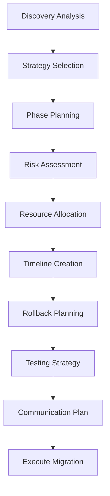

# Migration Planning Guide

Strategic planning guide for executing Docker to Podman migration on Apple Silicon Macs with minimal downtime and maximum success.

> **Navigation**: [← Discovery Process](discovery-process.md) | [Best Practices →](best-practices.md) | [Quick Start](quick-start.md)

**Related Documentation:**
- [Discovery Process](discovery-process.md) - Analyze your Docker environment
- [Best Practices](best-practices.md) - Apple Silicon Mac optimization techniques
- [Configuration Options](../api/configuration-options.md) - Customize your migration
- [Script Reference](../api/script-reference.md) - Complete command documentation
- [Common Issues](../troubleshooting/common-issues.md) - Migration troubleshooting

## Table of Contents

1. [Planning Overview](#planning-overview)
2. [Migration Strategy Selection](#migration-strategy-selection)
3. [Phase-Based Migration](#phase-based-migration)
4. [Risk Assessment and Mitigation](#risk-assessment-and-mitigation)
5. [Resource Planning](#resource-planning)
6. [Timeline and Scheduling](#timeline-and-scheduling)
7. [Rollback Planning](#rollback-planning)
8. [Testing and Validation](#testing-and-validation)
9. [Documentation and Communication](#documentation-and-communication)

## Planning Overview

### Migration Planning Process



### Planning Inputs

Your migration plan should be based on:
- **Discovery reports** from the analysis phase
- **Dependency mapping** showing service relationships
- **Compatibility scores** for each container
- **System resource analysis** for capacity planning
- **Business requirements** for uptime and performance

### Success Criteria

Define clear success metrics:
- **Functional**: All services running correctly on Podman
- **Performance**: Response times within 10% of baseline
- **Reliability**: No increase in error rates or downtime
- **Resource**: Efficient use of Apple Silicon Mac capabilities
- **Security**: Maintain or improve security posture

## Migration Strategy Selection

### Strategy Options

#### 1. Big Bang Migration
**Description**: Migrate all containers simultaneously during a maintenance window.

**Best for:**
- Small environments (< 10 containers)
- Development/testing environments
- Simple applications without complex dependencies

**Pros:**
- Quick completion
- Single maintenance window
- Simple rollback if needed

**Cons:**
- High risk if issues occur
- Extended downtime
- Limited ability to test incrementally

```bash
# Big Bang implementation
#!/bin/bash
# Stop all Docker containers
docker stop $(docker ps -q)

# Install and configure Podman
# ... installation steps ...

# Recreate all containers with Podman
for container in $(docker ps -a --format "{{.Names}}"); do
    # Migration logic for each container
    migrate_container "$container"
done
```

#### 2. Phased Migration (Recommended)
**Description**: Migrate containers in dependency-ordered phases.

**Best for:**
- Medium to large environments (10+ containers)
- Production systems with uptime requirements
- Complex multi-service applications

**Pros:**
- Lower risk per phase
- Incremental validation
- Easier troubleshooting
- Flexible timeline

**Cons:**
- Longer overall timeline
- Multiple maintenance windows
- Temporary hybrid state

```bash
# Phase-based implementation
#!/bin/bash
# Migrate Phase 1: Foundation services (databases, caches)
migrate_phase_1() {
    migrate_container "postgres"
    migrate_container "redis"
    validate_phase_1
}

# Migrate Phase 2: Application services
migrate_phase_2() {
    migrate_container "api-server"
    migrate_container "worker-service"
    validate_phase_2
}

# Migrate Phase 3: Frontend services
migrate_phase_3() {
    migrate_container "web-server"
    migrate_container "load-balancer"
    validate_phase_3
}
```

#### 3. Blue-Green Migration
**Description**: Set up parallel Podman environment, then switch traffic.

**Best for:**
- Critical production systems
- Systems requiring zero downtime
- Complex environments with external dependencies

**Pros:**
- Zero downtime
- Complete testing before switch
- Instant rollback capability
- Minimal risk

**Cons:**
- Requires double resources temporarily
- Complex setup and coordination
- Data synchronization challenges

```bash
# Blue-Green implementation
#!/bin/bash
# Setup green environment (Podman)
setup_green_environment() {
    # Install Podman alongside Docker
    # Deploy all services to green environment
    # Setup data replication
}

# Switch traffic to green
cutover_to_green() {
    # Update load balancer configuration
    # Switch DNS entries
    # Verify traffic flow
}
```

#### 4. Service-by-Service Migration
**Description**: Migrate individual services one at a time.

**Best for:**
- Microservices architectures
- Services with well-defined APIs
- Gradual risk tolerance

**Pros:**
- Minimal impact per migration
- Continuous validation
- Easy to pause or adjust

**Cons:**
- Longest timeline
- Complex state management
- Multiple validation points

### Strategy Decision Matrix

| Factor | Big Bang | Phased | Blue-Green | Service-by-Service |
|--------|----------|--------|------------|-------------------|
| **Environment Size** | Small | Medium-Large | Any | Large |
| **Downtime Tolerance** | High | Medium | None | Low |
| **Risk Tolerance** | High | Medium | Low | Low |
| **Resource Availability** | Low | Medium | High | Medium |
| **Complexity** | Low | Medium | High | High |
| **Timeline** | Days | Weeks | Weeks | Months |

## Phase-Based Migration

### Phase Planning Methodology

#### 1. Dependency Analysis
Use the dependency mapping from discovery to create phases:

```json
{
  "migration_phases": {
    "phase_1": {
      "name": "Foundation Layer",
      "containers": ["postgres", "redis", "rabbitmq"],
      "dependencies": [],
      "parallel_execution": true,
      "estimated_duration": "2-4 hours"
    },
    "phase_2": {
      "name": "Core Services",
      "containers": ["auth-service", "user-service"],
      "dependencies": ["postgres", "redis"],
      "parallel_execution": true,
      "estimated_duration": "3-6 hours"
    },
    "phase_3": {
      "name": "Business Logic",
      "containers": ["order-service", "payment-service"],
      "dependencies": ["user-service", "auth-service"],
      "parallel_execution": false,
      "estimated_duration": "4-8 hours"
    },
    "phase_4": {
      "name": "Frontend Layer",
      "containers": ["web-app", "api-gateway"],
      "dependencies": ["order-service", "payment-service"],
      "parallel_execution": true,
      "estimated_duration": "2-4 hours"
    }
  }
}
```

#### 2. Phase Characteristics

**Phase 1: Foundation Layer**
- Database servers (PostgreSQL, MySQL, MongoDB)
- Caching systems (Redis, Memcached)
- Message queues (RabbitMQ, Apache Kafka)
- Service discovery systems

**Characteristics:**
- No dependencies on other containers
- High impact if failure occurs
- Usually have ARM64 support
- Critical for subsequent phases

**Phase 2: Core Services**
- Authentication and authorization services
- User management systems
- Configuration services
- Logging and monitoring foundations

**Characteristics:**
- Depend on Phase 1 services
- Often custom applications
- May require code changes
- Critical for business logic

**Phase 3: Business Logic**
- Application-specific services
- Business rule engines
- Data processing services
- Integration services

**Characteristics:**
- Complex dependencies
- Custom business logic
- May require ARM64 rebuilds
- Moderate risk if issues occur

**Phase 4: Frontend Layer**
- Web servers and reverse proxies
- Static content servers
- Load balancers
- CDN edge services

**Characteristics:**
- Depend on all previous phases
- User-facing impact
- Usually standard components
- Easier to rollback

### Phase Execution Planning

#### Pre-Phase Checklist
- [ ] All dependencies from previous phases verified healthy
- [ ] Backup taken of all data and configurations
- [ ] Rollback procedure tested and ready
- [ ] Team members notified and available
- [ ] Monitoring systems prepared for new services

#### Phase Execution Steps
```bash
#!/bin/bash
# Phase execution template

execute_phase() {
    local phase_name="$1"
    local containers=("${@:2}")
    
    echo "=== Starting $phase_name ==="
    
    # Pre-phase validation
    validate_prerequisites "$phase_name"
    
    # Create backup point
    create_backup_point "$phase_name"
    
    # Execute migrations
    for container in "${containers[@]}"; do
        echo "Migrating $container..."
        migrate_container "$container"
        validate_container "$container"
    done
    
    # Post-phase validation
    validate_phase_complete "$phase_name"
    
    # Update monitoring
    update_monitoring_config "$phase_name"
    
    echo "=== $phase_name completed successfully ==="
}
```

#### Inter-Phase Validation
```bash
# Validation between phases
inter_phase_validation() {
    local completed_phase="$1"
    local next_phase="$2"
    
    # Health checks for completed services
    check_service_health "$completed_phase"
    
    # Performance baseline verification
    verify_performance_baseline "$completed_phase"
    
    # Integration testing
    run_integration_tests "$completed_phase"
    
    # Resource utilization check
    check_resource_utilization
    
    # Readiness for next phase
    validate_next_phase_readiness "$next_phase"
}
```

## Risk Assessment and Mitigation

### Risk Categories

#### 1. Technical Risks

**Container Compatibility Issues**
- **Risk**: ARM64 images not available or incompatible
- **Probability**: Medium-High
- **Impact**: High
- **Mitigation**: 
  - Identify alternatives during discovery
  - Build custom ARM64 images
  - Accept emulation performance penalty
  - Test thoroughly in development

**Data Loss or Corruption**
- **Risk**: Volume mounting or data migration issues
- **Probability**: Low-Medium  
- **Impact**: Critical
- **Mitigation**:
  - Complete backups before migration
  - Test data migration procedures
  - Use staging environment validation
  - Implement checksum verification

**Network Configuration Issues**
- **Risk**: Service connectivity problems after migration
- **Probability**: Medium
- **Impact**: High
- **Mitigation**:
  - Document all network configurations
  - Test network connectivity between phases
  - Maintain network troubleshooting tools
  - Plan network rollback procedures

#### 2. Operational Risks

**Extended Downtime**
- **Risk**: Migration takes longer than planned
- **Probability**: Medium
- **Impact**: High
- **Mitigation**:
  - Build buffer time into schedules
  - Practice migration procedures
  - Prepare rollback triggers
  - Communicate realistic timelines

**Team Availability**
- **Risk**: Key team members unavailable during migration
- **Probability**: Medium
- **Impact**: Medium
- **Mitigation**:
  - Cross-train multiple team members
  - Schedule around known conflicts
  - Prepare detailed runbooks
  - Establish escalation procedures

#### 3. Business Risks

**Service Degradation**
- **Risk**: Performance issues after migration
- **Probability**: Medium
- **Impact**: Medium-High
- **Mitigation**:
  - Establish performance baselines
  - Monitor key metrics during migration
  - Prepare performance tuning procedures
  - Plan gradual traffic increase

**Customer Impact**
- **Risk**: User-facing service interruptions
- **Probability**: Low-Medium
- **Impact**: High
- **Mitigation**:
  - Schedule during low-usage periods
  - Communicate maintenance windows
  - Prepare customer support scripts
  - Implement graceful degradation

### Risk Mitigation Strategies

#### Pre-Migration Risk Reduction
```bash
# Risk reduction checklist
pre_migration_risk_reduction() {
    # 1. Complete testing in staging
    run_full_staging_test
    
    # 2. Verify all backups
    validate_backup_integrity
    
    # 3. Test rollback procedures
    practice_rollback_procedure
    
    # 4. Update documentation
    finalize_migration_docs
    
    # 5. Prepare monitoring
    setup_migration_monitoring
    
    # 6. Team readiness check
    confirm_team_availability
}
```

#### Runtime Risk Monitoring
```bash
# Continuous risk monitoring during migration
monitor_migration_risks() {
    while migration_in_progress; do
        # Check service health
        if ! check_all_services_healthy; then
            alert_team "Service health issue detected"
            consider_rollback
        fi
        
        # Monitor resource usage
        if resource_usage_exceeds_threshold; then
            alert_team "Resource usage high"
            throttle_migration_speed
        fi
        
        # Check error rates
        if error_rate_above_baseline; then
            alert_team "Error rate spike detected"
            pause_migration
        fi
        
        sleep 30
    done
}
```

## Resource Planning

### Apple Silicon Mac Resource Optimization

#### CPU Allocation Strategy
```bash
# Apple Silicon Mac CPU configuration
configure_apple_silicon_cpu() {
    local total_cores=$(sysctl -n hw.ncpu)
    local performance_cores=$(sysctl -n hw.perflevel0.physicalcpu)
    local efficiency_cores=$(sysctl -n hw.perflevel1.physicalcpu)
    
    # Reserve 25% for macOS
    local container_cores=$((total_cores * 75 / 100))
    
    echo "Total cores: $total_cores"
    echo "Performance cores: $performance_cores"
    echo "Efficiency cores: $efficiency_cores"
    echo "Available for containers: $container_cores"
    
    # Configure Podman resource limits
    podman system connection default --cpus="$container_cores"
}
```

#### Memory Allocation Strategy
```bash
# Apple Silicon Mac memory configuration
configure_apple_silicon_memory() {
    local total_memory_gb=$(( $(sysctl -n hw.memsize) / 1024 / 1024 / 1024 ))
    local container_memory_gb=$((total_memory_gb * 75 / 100))
    
    echo "Total memory: ${total_memory_gb}GB"
    echo "Available for containers: ${container_memory_gb}GB"
    
    # Configure Podman memory limits
    podman system connection default --memory="${container_memory_gb}g"
}
```

#### Storage Optimization
```bash
# Apple Silicon Mac storage optimization
optimize_apple_silicon_storage() {
    # Use Apple File System (APFS) snapshots for backups
    create_apfs_snapshot "pre-migration-$(date +%Y%m%d)"
    
    # Configure Podman to use optimal storage driver
    podman info --format "{{.Store.GraphDriverName}}"  # Should be 'overlay'
    
    # Set up storage cleanup automation
    setup_storage_cleanup_cron
}
```

### Container Resource Allocation

#### Resource Allocation Matrix
```yaml
# Container resource allocation based on Apple Silicon Mac analysis
resource_allocation:
  small_environment:  # 8GB RAM, 8 cores
    system_reserved: "2GB RAM, 2 cores"
    container_pool: "6GB RAM, 6 cores"
    per_container_limits:
      database: "2GB RAM, 2 cores"
      application: "1GB RAM, 1 core"
      web_server: "512MB RAM, 0.5 cores"
      
  medium_environment:  # 16GB RAM, 8 cores
    system_reserved: "4GB RAM, 2 cores"
    container_pool: "12GB RAM, 6 cores"
    per_container_limits:
      database: "4GB RAM, 2 cores"
      application: "2GB RAM, 1 core"
      web_server: "1GB RAM, 1 core"
      
  large_environment:  # 32GB+ RAM, 10+ cores
    system_reserved: "8GB RAM, 2 cores"
    container_pool: "24GB+ RAM, 8+ cores"
    per_container_limits:
      database: "8GB RAM, 4 cores"
      application: "4GB RAM, 2 cores"
      web_server: "2GB RAM, 1 core"
```

#### Dynamic Resource Allocation
```bash
# Dynamic resource allocation based on workload
allocate_resources_dynamically() {
    local container_name="$1"
    local workload_type="$2"
    
    case "$workload_type" in
        "database")
            # I/O intensive, needs consistent resources
            podman run --memory="4g" --cpus="2" --memory-swappiness=10 "$container_name"
            ;;
        "compute")
            # CPU intensive, can use burst
            podman run --memory="2g" --cpus="4" --cpu-shares=1024 "$container_name"
            ;;
        "web")
            # Network intensive, moderate resources
            podman run --memory="1g" --cpus="1" --network=bridge "$container_name"
            ;;
    esac
}
```

## Timeline and Scheduling

### Migration Timeline Template

#### Small Environment (1-10 containers)
```yaml
timeline_small:
  preparation: "1-2 weeks"
  execution: "1-2 days"
  validation: "3-5 days"
  total_duration: "2-3 weeks"
  
  milestones:
    week_1:
      - Complete discovery analysis
      - Install and configure Podman
      - Test migration procedures in development
    week_2:
      - Prepare production migration scripts
      - Schedule maintenance window
      - Execute migration (4-8 hours)
    week_3:
      - Monitor and validate
      - Performance tuning
      - Documentation updates
```

#### Medium Environment (10-50 containers)
```yaml
timeline_medium:
  preparation: "3-4 weeks"
  execution: "1-2 weeks"
  validation: "1-2 weeks"
  total_duration: "6-8 weeks"
  
  milestones:
    weeks_1_2:
      - Discovery and analysis
      - Strategy finalization
      - Team training
    weeks_3_4:
      - Environment preparation
      - Testing and validation procedures
      - Rollback procedure testing
    weeks_5_6:
      - Phase 1-2 execution
      - Inter-phase validation
      - Performance monitoring
    weeks_7_8:
      - Phase 3-4 execution
      - Final validation
      - Cleanup and documentation
```

#### Large Environment (50+ containers)
```yaml
timeline_large:
  preparation: "6-8 weeks"
  execution: "4-6 weeks"
  validation: "2-4 weeks"
  total_duration: "12-18 weeks"
  
  milestones:
    month_1:
      - Comprehensive discovery
      - Detailed planning
      - Tool and process development
    month_2:
      - Staging environment setup
      - Testing and refinement
      - Team training and practice
    month_3:
      - Phase 1-2 execution
      - Critical service migration
      - Stability validation
    month_4:
      - Phase 3-4 execution
      - Final service migration
      - Performance optimization
```

### Scheduling Considerations

#### Optimal Migration Windows
```yaml
scheduling_preferences:
  time_of_day:
    best: "2 AM - 6 AM local time"
    acceptable: "10 PM - 8 AM local time"
    avoid: "8 AM - 6 PM business hours"
    
  day_of_week:
    best: "Saturday night / Sunday morning"
    acceptable: "Friday night / Monday morning"
    avoid: "Tuesday - Thursday (peak business days)"
    
  seasonal_considerations:
    avoid: 
      - "Holiday seasons (Nov-Dec, July)"
      - "End of quarter/fiscal year"
      - "Major product releases"
    prefer:
      - "January - March (post-holiday)"
      - "May - June (stable period)"
```

#### Maintenance Window Planning
```bash
# Maintenance window calculator
calculate_maintenance_window() {
    local container_count="$1"
    local complexity_factor="$2"  # 1.0-3.0
    
    # Base time: 30 minutes per container
    local base_time=$((container_count * 30))
    
    # Apply complexity factor
    local estimated_time=$(echo "$base_time * $complexity_factor" | bc)
    
    # Add 50% buffer for unexpected issues
    local total_time=$(echo "$estimated_time * 1.5" | bc)
    
    echo "Estimated migration time: ${total_time} minutes"
    echo "Recommended maintenance window: $(echo "$total_time * 1.2" | bc) minutes"
}
```

## Rollback Planning

### Rollback Triggers

Define clear criteria for rollback decision:

```yaml
rollback_triggers:
  automatic:
    - "Critical service down for > 15 minutes"
    - "Error rate > 5x baseline for > 10 minutes"
    - "Response time > 3x baseline for > 20 minutes"
    - "Data corruption detected"
    
  manual:
    - "Unforeseen technical issues"
    - "Business stakeholder decision"
    - "Team capacity exceeded"
    - "Customer escalations"
    
  rollback_sla:
    decision_time: "15 minutes maximum"
    execution_time: "30 minutes to restore service"
    communication_time: "5 minutes to notify stakeholders"
```

### Rollback Procedures

#### Full Environment Rollback
```bash
#!/bin/bash
# full_rollback.sh - Complete rollback to Docker

full_rollback() {
    echo "=== INITIATING FULL ROLLBACK ==="
    
    # 1. Stop all Podman containers
    podman stop --all
    
    # 2. Restore Docker containers from backup
    restore_docker_containers
    
    # 3. Restore network configurations
    restore_network_config
    
    # 4. Restore volume data
    restore_volume_data
    
    # 5. Start Docker services
    start_docker_services
    
    # 6. Validate rollback
    validate_rollback_success
    
    echo "=== ROLLBACK COMPLETED ==="
}
```

#### Phase-Specific Rollback
```bash
#!/bin/bash
# phase_rollback.sh - Rollback specific migration phase

phase_rollback() {
    local phase="$1"
    
    echo "=== ROLLING BACK PHASE: $phase ==="
    
    case "$phase" in
        "phase_1")
            rollback_foundation_services
            ;;
        "phase_2")
            rollback_core_services
            restore_phase_1_dependencies
            ;;
        "phase_3")
            rollback_business_services
            restore_phase_2_dependencies
            ;;
        "phase_4")
            rollback_frontend_services
            # Other phases should still be on Podman
            ;;
    esac
    
    validate_phase_rollback "$phase"
}
```

### Rollback Validation

```bash
# Rollback validation checklist
validate_rollback() {
    local checks_passed=0
    local total_checks=0
    
    # Service availability checks
    for service in "${critical_services[@]}"; do
        if check_service_available "$service"; then
            ((checks_passed++))
        fi
        ((total_checks++))
    done
    
    # Performance checks
    if validate_response_times; then
        ((checks_passed++))
    fi
    ((total_checks++))
    
    # Data integrity checks
    if validate_data_integrity; then
        ((checks_passed++))
    fi
    ((total_checks++))
    
    # Calculate success rate
    local success_rate=$((checks_passed * 100 / total_checks))
    
    if [[ $success_rate -ge 95 ]]; then
        echo "Rollback validation: SUCCESS ($success_rate%)"
        return 0
    else
        echo "Rollback validation: FAILED ($success_rate%)"
        return 1
    fi
}
```

## Testing and Validation

### Pre-Migration Testing

#### Staging Environment Validation
```bash
# Staging migration test
staging_migration_test() {
    echo "=== STAGING MIGRATION TEST ==="
    
    # 1. Clone production configuration to staging
    clone_production_config_to_staging
    
    # 2. Execute migration in staging
    execute_migration_procedure "staging"
    
    # 3. Run comprehensive tests
    run_integration_tests "staging"
    run_performance_tests "staging"
    run_security_tests "staging"
    
    # 4. Measure and document results
    document_staging_results
    
    # 5. Practice rollback procedure
    test_rollback_procedure "staging"
}
```

#### Load Testing
```bash
# Load testing for migrated services
load_test_migrated_services() {
    local environment="$1"
    
    # Generate baseline load
    generate_baseline_load "$environment"
    
    # Measure key metrics
    measure_response_times
    measure_throughput
    measure_resource_utilization
    measure_error_rates
    
    # Compare with pre-migration baseline
    compare_with_baseline
    
    # Generate load test report
    generate_load_test_report
}
```

### Post-Migration Validation

#### Comprehensive Health Checks
```bash
# Post-migration health validation
post_migration_validation() {
    echo "=== POST-MIGRATION VALIDATION ==="
    
    # Service health checks
    validate_all_services_running
    validate_service_connectivity
    validate_database_connections
    
    # Performance validation
    validate_response_times
    validate_throughput_metrics
    validate_resource_usage
    
    # Data integrity validation
    validate_data_consistency
    validate_backup_integrity
    
    # Security validation
    validate_security_policies
    validate_network_isolation
    
    # Generate validation report
    generate_validation_report
}
```

## Documentation and Communication

### Stakeholder Communication Plan

#### Communication Matrix
```yaml
stakeholders:
  executive_team:
    frequency: "Weekly during preparation, daily during execution"
    content: "High-level progress, risks, timeline"
    format: "Executive summary (1 page)"
    
  development_team:
    frequency: "Daily during preparation and execution"
    content: "Technical details, issues, next steps"
    format: "Technical standup, Slack updates"
    
  operations_team:
    frequency: "Real-time during execution"
    content: "System status, alerts, procedures"
    format: "Dashboard, alerts, runbooks"
    
  business_users:
    frequency: "Weekly before, daily during execution"
    content: "Service availability, expected impacts"
    format: "Email updates, status page"
```

#### Communication Templates

**Executive Status Report**
```markdown
# Migration Status Report - Week X

## Executive Summary
- **Overall Progress**: 65% complete
- **Current Phase**: Phase 2 (Core Services)
- **Timeline**: On track for completion by [date]
- **Risks**: 2 medium risks identified and mitigated

## Key Metrics
- **Services Migrated**: 12 of 18 (67%)
- **Compatibility Score**: 87% (target: >80%)
- **Performance Impact**: <5% degradation (within target)

## Upcoming Week
- Complete Phase 2 migration
- Begin Phase 3 preparation
- Conduct mid-migration review
```

**Technical Team Update**
```markdown
# Technical Migration Update - Day X

## Today's Progress
- ✅ Migrated postgres and redis containers
- ✅ Validated data integrity post-migration
- ⚠️ Minor performance tuning needed for redis
- ❌ auth-service migration postponed due to ARM64 image issue

## Issues and Resolutions
- **Issue**: auth-service image not ARM64 compatible
- **Resolution**: Building custom ARM64 image, ETA 2 hours
- **Impact**: Phase 2 delayed by 4 hours

## Tomorrow's Plan
- Complete auth-service migration with custom image
- Begin user-service migration
- Run inter-phase validation tests
```

### Migration Documentation

#### Migration Runbook Template
```markdown
# Migration Runbook: [Service Name]

## Pre-Migration Checklist
- [ ] Backup completed and verified
- [ ] Team members available
- [ ] Monitoring systems prepared
- [ ] Rollback procedure ready

## Migration Steps
1. **Stop Docker container**
   ```bash
   docker stop [container-name]
   ```

2. **Export container configuration**
   ```bash
   docker inspect [container-name] > container-config.json
   ```

3. **Create Podman container**
   ```bash
   podman run -d --name [container-name] \
     --memory 2g --cpus 2 \
     -v [volume-mapping] \
     -p [port-mapping] \
     [image-name]
   ```

4. **Validate migration**
   - [ ] Container status: Running
   - [ ] Health check: Passing
   - [ ] Connectivity: Verified
   - [ ] Performance: Within baseline

## Rollback Procedure
If issues occur within 30 minutes:
1. Stop Podman container: `podman stop [container-name]`
2. Start Docker container: `docker start [container-name]`
3. Validate service restoration
4. Notify team of rollback

## Post-Migration Tasks
- [ ] Update monitoring configuration
- [ ] Update documentation
- [ ] Remove Docker container: `docker rm [container-name]`
```

---

**Next Steps**: With your migration plan complete, proceed to implement the strategy. Use the [Best Practices for M1 Macs](best-practices.md) guide to optimize your Podman configuration for Apple Silicon performance.